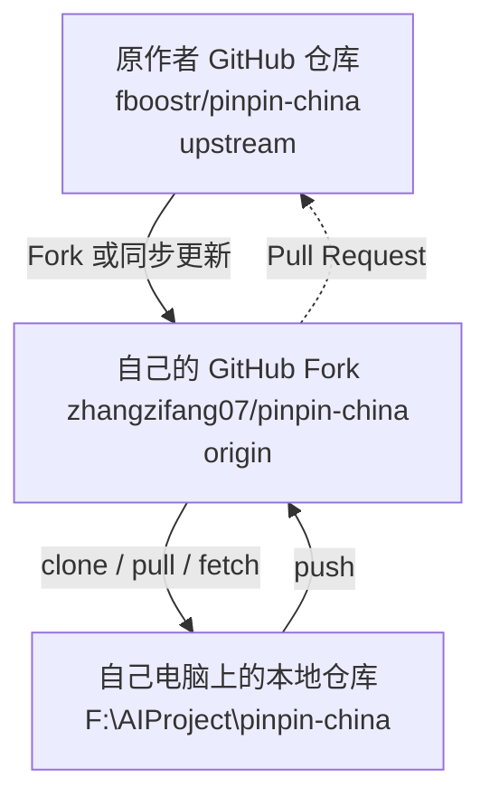
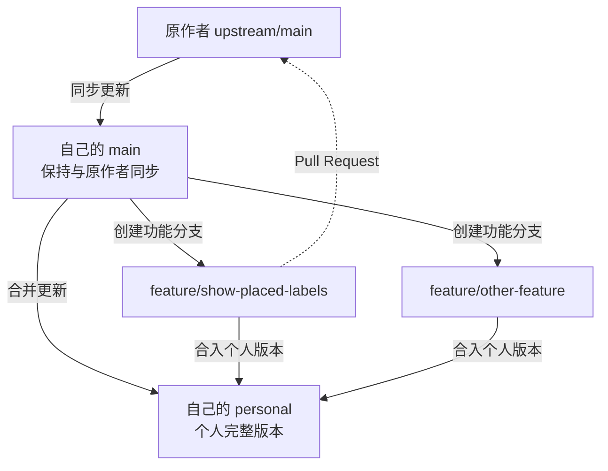
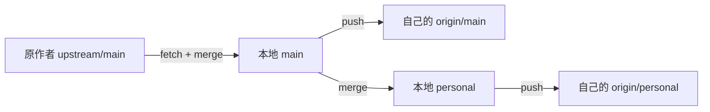

很多人第一次在 GitHub 上 Fork 项目时，会产生这些疑问：

- Fork 以后还需要创建分支吗？
- 本地仓库、自己的 Fork、原作者仓库是什么关系？
- 自己开发的代码应该放在哪个分支？
- 怎样获取原作者后续发布的更新？
- 怎样把自己的功能贡献给原作者？
- `origin` 和 `upstream` 分别是什么？
- 为什么 `git add` 会提示 LF 和 CRLF？

本文通过一个真实案例，完整讲解如何 Fork、下载、修改、提交、同步和贡献一个 GitHub 项目。

案例中的仓库：

- 原作者仓库：`fboostr/pinpin-china`
- Fork 后的仓库：`zhangzifang07/pinpin-china`
- 本地目录：`F:\AIProject\pinpin-china`

---

## 一、先理解三个仓库

完成 Fork 和 Clone 后，实际上存在三个仓库。



### 1. 原作者仓库

这是项目的官方来源：

```text
https://github.com/fboostr/pinpin-china
```

通常将它命名为 `upstream`，可以理解为“上游仓库”。

### 2. 自己的 GitHub Fork

在 GitHub 点击 Fork 后，会在自己的账号下产生一份仓库：

```text
https://github.com/zhangzifang07/pinpin-china
```

本地 Git 通常将它命名为 `origin`。日常执行 `git push` 时，代码一般会上传到这里。

### 3. 本地仓库

使用 `git clone` 下载到电脑上的项目：

```text
F:\AIProject\pinpin-china
```

代码修改、测试、提交等操作主要在本地完成。

---

## 二、Fork 和分支不是一回事

这是最容易混淆的地方。

### Fork 是复制仓库

Fork 会在自己的 GitHub 账号下复制整个项目：

```text
原作者仓库
    ↓ Fork
自己的 GitHub 仓库
```

### Branch 是仓库内部的代码分支

一个仓库中可以有很多分支：

```text
pinpin-china
├── main
├── personal
├── feature/show-placed-labels
└── feature/other-feature
```

所以：

- Fork 解决的是“仓库归谁管理”。
- Branch 解决的是“不同修改如何隔离”。

即使已经 Fork，开发新功能时仍然建议创建分支。

---

## 三、Fork 并下载项目

先在 GitHub 原项目页面点击 Fork。

然后克隆自己的 Fork，而不是直接克隆原作者仓库：

```powershell
git clone git@github.com:zhangzifang07/pinpin-china.git
cd pinpin-china
```

命令说明：

- `git clone`：把远程仓库完整下载到本地。
- `cd pinpin-china`：进入项目目录。
- SSH 地址可以使用本机配置好的 GitHub SSH 密钥进行身份验证。

检查远程配置：

```powershell
git remote -v
```

刚克隆完成时一般只有：

```text
origin  git@github.com:zhangzifang07/pinpin-china.git
```

这里的 `origin` 指自己的 Fork。

---

## 四、添加原作者仓库 upstream

为了以后获取原作者更新，需要添加原作者仓库：

```powershell
git remote add upstream git@github.com:fboostr/pinpin-china.git
```

命令说明：

- `git remote`：管理远程仓库。
- `add`：添加一个远程仓库。
- `upstream`：给原作者仓库起的本地名称。
- 最后的地址是原作者仓库的 SSH 地址。

检查配置：

```powershell
git remote -v
```

正确结果类似：

```text
origin    git@github.com:zhangzifang07/pinpin-china.git
upstream  git@github.com:fboostr/pinpin-china.git
```

此后需要记住：

```text
origin   = 自己的 GitHub Fork
upstream = 原作者的 GitHub 仓库
```

---

## 五、HTTPS 连接被重置怎么办

本案例最初使用的是 HTTPS：

```text
https://github.com/fboostr/pinpin-china.git
```

执行：

```powershell
git fetch upstream
```

出现错误：

```text
Recv failure: Connection was reset
```

这通常是网络连接被重置，并不表示仓库损坏，也不会丢失代码。

因为 `origin` 已经通过 SSH 正常推送，所以可以将 `upstream` 也改为 SSH：

```powershell
git remote set-url upstream git@github.com:fboostr/pinpin-china.git
```

命令说明：

- `git remote set-url`：修改远程仓库地址。
- `upstream`：要修改的远程仓库名称。
- 最后的参数是新的 SSH 地址。

然后重新获取：

```powershell
git fetch upstream
```

如果没有输出，通常表示执行成功。

---

## 六、推荐的分支结构

如果既想维护自己的版本，又想获取原作者更新，还可能向原作者贡献代码，推荐使用三层分支结构：

| 分支 | 用途 |
| --- | --- |
| `main` | 与原作者的 `main` 保持同步 |
| `personal` | 汇总自己的全部功能，作为个人完整版本 |
| `feature/*` | 每个功能单独开发，也用于提交 PR |



这种结构的优点是：

- `main` 保持干净，容易同步原作者。
- `personal` 可以包含只属于自己的功能。
- 每个 `feature/*` 只包含一个功能，方便提交 PR。
- 不会将多个无关的个人修改一起提交给原作者。

---

## 七、同步原作者的 main

首先切换到本地 `main`：

```powershell
git switch main
```

命令说明：

- `git switch`：切换分支。
- `main`：要切换到的目标分支。

如果显示：

```text
Your branch is up to date with 'origin/main'.
```

表示本地 `main` 与自己的 GitHub Fork 的 `main` 一致。

获取原作者的最新提交：

```powershell
git fetch upstream
```

`git fetch` 只会下载远程提交信息，不会直接修改当前代码。

然后同步：

```powershell
git merge --ff-only upstream/main
```

命令说明：

- `git merge`：将另一个分支合入当前分支。
- `upstream/main`：原作者仓库的 `main`。
- `--ff-only`：只允许安全的快进更新。

如果显示：

```text
Already up to date.
```

表示本地 `main` 已经与原作者一致。

最后将本地 `main` 推送到自己的 Fork：

```powershell
git push origin main
```

如果显示：

```text
Everything up-to-date
```

表示三者的 `main` 完全一致：

```text
原作者 upstream/main
        =
本地 main
        =
自己的 origin/main
```

---

## 八、创建功能分支

本案例需要新增“拼图归位后显示区域名称”的功能。

从 `main` 创建功能分支：

```powershell
git switch -c feature/show-placed-labels
```

命令说明：

- `git switch`：切换分支。
- `-c`：创建一个新分支。
- `feature/show-placed-labels`：新分支名称。

它相当于：

```powershell
git branch feature/show-placed-labels
git switch feature/show-placed-labels
```

如果直接执行：

```powershell
git switch feature/show-placed-labels
```

但分支尚未创建，就会出现：

```text
fatal: invalid reference: feature/show-placed-labels
```

第一次创建必须带 `-c`。以后切换已有分支则不需要：

```powershell
git switch feature/show-placed-labels
```

---

## 九、修改、暂存和提交代码

本次功能修改了两个文件：

```text
css/styles.css
js/render.js
```

查看当前状态：

```powershell
git status
```

暂存修改：

```powershell
git add .
```

命令说明：

- `git add`：把修改加入暂存区。
- `.`：暂存当前目录下的所有修改。

如果只想暂存指定文件，可以写：

```powershell
git add css/styles.css js/render.js
```

提交之前，可以检查暂存内容：

```powershell
git diff --cached
```

然后提交：

```powershell
git commit -m "feat: 拼图归位后显示区域名称"
```

命令说明：

- `git commit`：创建一次本地提交。
- `-m`：直接提供提交说明。
- `feat`：表示新增功能。

常见提交类型：

| 类型 | 用途 |
| --- | --- |
| `feat` | 新增功能 |
| `fix` | 修复错误 |
| `docs` | 修改文档 |
| `style` | 调整格式或样式 |
| `refactor` | 重构但不改变功能 |
| `test` | 增加或修改测试 |
| `chore` | 构建、配置等辅助工作 |

本次属于新增显示能力，因此使用 `feat` 比 `fix` 更合适。

---

## 十、LF 和 CRLF 警告是什么意思

执行 `git add .` 时可能出现：

```text
LF will be replaced by CRLF the next time Git touches it
```

这不是错误，而是换行符提示：

- `LF`：Linux 和 macOS 常用。
- `CRLF`：Windows 常用。

Git 提示未来在 Windows 工作区处理文件时，可能将换行符转换为 CRLF。

这种提示通常不会影响代码运行，也不会阻止提交。提交前仍应使用 `git status`，确认暂存区只有本次需要提交的文件。

---

## 十一、推送功能分支

提交后，将功能分支上传到自己的 Fork：

```powershell
git push -u origin feature/show-placed-labels
```

命令说明：

- `git push`：将本地提交上传到远程仓库。
- `origin`：自己的 GitHub Fork。
- `feature/show-placed-labels`：要推送的分支。
- `-u`：建立本地分支与远程分支的跟踪关系。

第一次推送需要完整命令。以后在这个分支只需：

```powershell
git push
```

此时关系是：

```text
原作者 upstream/main
└── 还没有这个功能

自己的 origin/main
└── 还没有这个功能

自己的 origin/feature/show-placed-labels
└── 包含“显示区域名称”功能

本地 feature/show-placed-labels
└── 包含“显示区域名称”功能
```

---

## 十二、创建 personal 个人版本分支

切换回干净的 `main`：

```powershell
git switch main
```

创建个人版本分支：

```powershell
git switch -c personal
```

此时 `personal` 暂时与 `main` 相同。

将功能分支合入个人版本：

```powershell
git merge feature/show-placed-labels
```

如果输出：

```text
Fast-forward
```

表示 Git 只需要将分支指针向前移动，没有冲突，也没有产生额外的合并提交。

然后上传个人版本：

```powershell
git push -u origin personal
```

当前关系变成：

```text
main
├── 与原作者保持同步
│
├── feature/show-placed-labels
│   └── 只包含“显示区域名称”功能
│
└── personal
    └── 基础版本 + 显示区域名称功能
```

虽然 `personal` 和功能分支当前可能指向同一个提交，但它们的用途不同：

- `feature/show-placed-labels` 用于描述一个独立功能。
- `personal` 用于汇总未来所有个人功能。

---

## 十三、不要把 personal 整体提交给原作者

GitHub 推送新分支后可能提示：

```text
Create a pull request for 'personal'
```

这只是 GitHub 的通用提示，不代表一定要创建。

不建议将 `personal` 整体提交给原作者，因为它以后可能包含多个不同功能、个人定制内容、原作者不需要的修改或尚未完成的实验代码。

向原作者贡献时，应该使用独立的 `feature/*` 分支。

---

## 十四、向原作者提交 Pull Request

本次应使用：

```text
feature/show-placed-labels
```

创建 PR 时检查：

```text
base repository：fboostr/pinpin-china
base branch：main

head repository：zhangzifang07/pinpin-china
compare branch：feature/show-placed-labels
```

可以理解为：

> 请求原作者将我的 `feature/show-placed-labels` 合入他的 `main`。

PR 标题可以写：

```text
feat: 拼图归位后显示区域名称
```

PR 描述示例：

```markdown
## 修改内容

- 全国拼图中，区域归位后显示省级行政区名称
- 分省拼图中，地市归位后显示地市名称
- 增加文字描边，提升不同颜色背景下的可读性

## 验证

- 全国模式放置辽宁后正确显示名称
- 河南分省模式放置郑州后正确显示名称
- JavaScript 语法检查通过
- 全国和分省数据校验通过
```

PR 提交后，原作者可以查看代码差异、提出修改建议、接受并合并或者拒绝这个功能。

无论原作者是否接受，都不会影响自己 `personal` 中的功能。

---

## 十五、原作者合并 PR 后怎么同步

原作者合并 PR 后，先更新本地 `main`：

```powershell
git switch main
git fetch upstream
git merge --ff-only upstream/main
git push origin main
```

此时：

```text
原作者 upstream/main
        =
本地 main
        =
自己的 origin/main
```

然后把最新 `main` 合入个人版本：

```powershell
git switch personal
git merge main
git push
```

最终数据流是：



---

## 十六、以后开发新功能的标准流程

### 第一步：更新 main

```powershell
git switch main
git fetch upstream
git merge --ff-only upstream/main
git push origin main
```

### 第二步：创建独立功能分支

```powershell
git switch -c feature/新功能名称
```

例如：

```powershell
git switch -c feature/add-hints
```

### 第三步：开发并提交

```powershell
git status
git add .
git commit -m "feat: 增加拼图提示功能"
git push -u origin feature/add-hints
```

### 第四步：合入个人版本

```powershell
git switch personal
git merge feature/add-hints
git push
```

### 第五步：决定是否贡献给原作者

如果功能通用、代码完整并且适合原项目，就从：

```text
zhangzifang07/pinpin-china:feature/add-hints
```

向：

```text
fboostr/pinpin-china:main
```

提交 Pull Request。

---

## 十七、只想自己开发，可以不管原作者吗

可以。

如果不打算获取原作者更新，也不打算提交 PR，日常关系可以简化为：

```text
本地仓库
   ↕ pull / push
自己的 GitHub Fork
```

原作者仓库不会受到影响。

但是随着时间推移，双方代码会逐渐分叉：

```text
原作者：A → B → C → D
你的版本：A → B → 个人功能1 → 个人功能2
```

这并不是错误，只是意味着你的 Fork 已经成为独立版本。如果希望继续获得原作者更新，就应保留 `upstream`，定期同步。

---

## 十八、常用 Git 命令解释

### 查看当前状态

```powershell
git status
```

查看当前分支、修改文件和暂存状态。

### 查看所有分支

```powershell
git branch -a
```

- 不带 `-a`：只看本地分支。
- 带 `-a`：同时显示远程分支。

### 创建并切换分支

```powershell
git switch -c feature/example
```

### 切换已有分支

```powershell
git switch main
```

### 获取远程更新

```powershell
git fetch upstream
```

只下载提交信息，不直接修改当前代码。

### 合并分支

```powershell
git merge feature/example
```

将指定分支的代码合入当前分支。

### 安全同步原作者 main

```powershell
git merge --ff-only upstream/main
```

仅允许快进更新，遇到分叉时停止。

### 暂存修改

```powershell
git add .
```

将当前目录下所有修改加入暂存区。

### 创建提交

```powershell
git commit -m "feat: 功能说明"
```

### 推送分支

```powershell
git push -u origin feature/example
```

上传分支并设置跟踪关系。

### 查看远程仓库

```powershell
git remote -v
```

### 修改远程仓库地址

```powershell
git remote set-url upstream 新地址
```

### 查看提交记录

```powershell
git log --oneline --graph --decorate --all
```

以紧凑图形方式显示所有分支的提交关系。

---

## 十九、最终推荐的协作模型

```text
upstream/main
    │
    │ 同步原作者更新
    ▼
main
    │
    ├── feature/功能A ── Pull Request ──→ 原作者
    │           │
    │           └── merge ──→ personal
    │
    ├── feature/功能B ── Pull Request ──→ 原作者
    │           │
    │           └── merge ──→ personal
    │
    └───────────────────────→ personal
```

每个部分职责明确：

- `upstream/main`：原作者官方版本。
- `origin/main`：自己的 Fork 中与官方同步的版本。
- 本地 `main`：同步和创建功能分支的基础。
- `feature/*`：一个分支只完成一个功能。
- `personal`：自己的完整定制版本。
- Pull Request：把独立功能贡献给原作者。

## 总结

整个协作过程可以概括为：

```text
Fork 原作者仓库
    ↓
Clone 自己的 Fork
    ↓
配置 origin 和 upstream
    ↓
让 main 与 upstream/main 保持同步
    ↓
从 main 创建 feature 功能分支
    ↓
修改、提交并推送到自己的 Fork
    ↓
合入 personal 作为个人版本
    ↓
优秀且通用的功能通过 PR 提交给原作者
    ↓
原作者合并后再次同步 main 和 personal
```

最重要的原则只有三条：

1. `main` 用来同步原作者，尽量不要直接开发。
2. 一个功能使用一个 `feature/*` 分支。
3. `personal` 保存自己的完整版本，不要整体提交给原作者。
